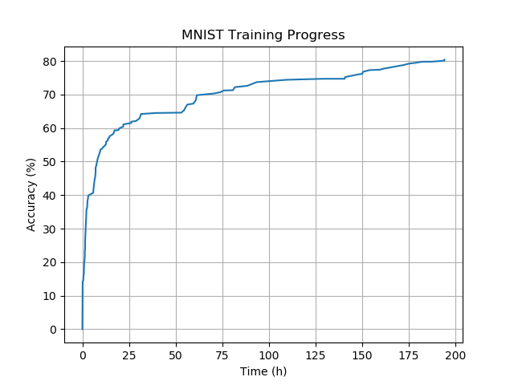

# EAGLE
Evolutionary, Automatic and Generic Learning Environment.

## About
EAGLE is a NAS implementation that finds Neural Network architectures without making any assumptions about their internal structure.

## MNIST architecture search
In this experiment EAGLE finds a network model that can classify MNIST handwritten characters. The diagram shows evolution of the model trained on a single CPU (not GPU) in a few days.

