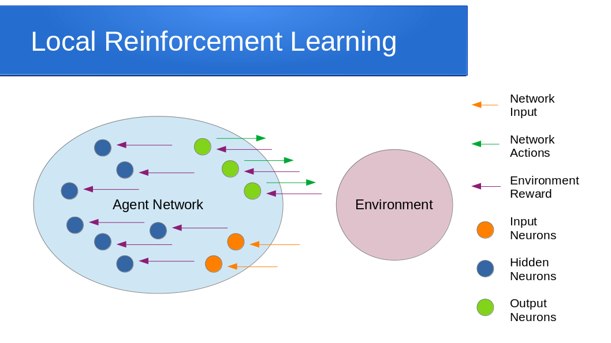
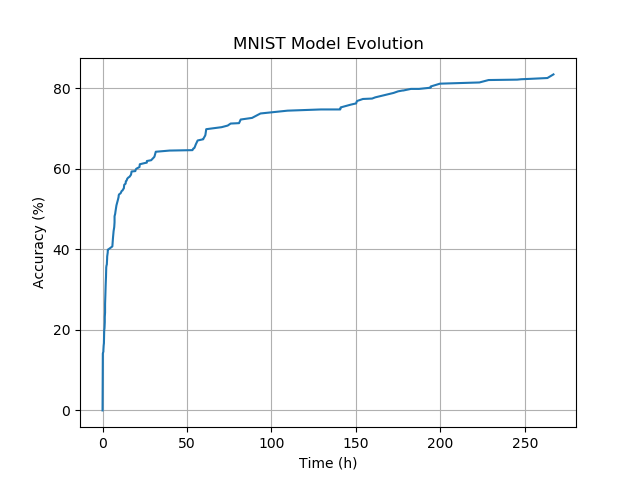

# EAGLE
an **E**volutionary, **A**utomatic and **G**eneric **L**earning **E**nvironment.

## About
EAGLE is a NAS implementation that finds Neural Network architectures from scrach, without making any assumptions about their internal structure, only based on data.

## Features
1. Uses Genetic Algorithms to evolve NN architectures
2. Is distributed, runs on multiple cores and multiple machines
3. Grows architecture search space automatically on demand.
4. Uses Model Morphing to share trained weights between differen architectures.
5. Trains models with the original and novel Local Reinforcement Learning method

## Local Reinforcement Learning

Reinforcement learning is a type of machine learning where an agent such as neural network learns by interacting with an environment. The agent sends actions to the environment and the environment provides input and feedback to the agent. The correct agent actions are rewarded by the environment higher, and the incorrect actions are rewarded less. The agent learns to act correctly by correlating input, actions and rewards.

In typical reinforcement learning configuration the environment reward is passed through network starting from output neurons down to hidden neurons via links between the neurons. The output neurons are updated directly from the environment reward and the hidden network are updated based on the feedback from the connected output neurons. In this case the environment feedback is only available to the output neurons. Since the individual neurons are updated based on feedback from other neurons located anywhere in the network, we call this process Global Reinforcement Learning.

In contrast to the traditional approach, Local Reinforcement Learning (LRL) updates all neurons locally by providing environment feedback directly to each neuron. Direct environment feedback allows each neuron to  learn independently without necessity to interact with other neurons. In LRL the neuron actions are binary and the actions are sampled based on neuron activation levels. The actions of individual neurons serve as the inputs to the receiving neurons. All neurons are updated separatelly using the same RL methods as the entire network in the traditional approach. This effectively makes each LRL neuron behave as an individual mini-agent acting on the environment. The output neurons act directly on the environment and the hidden neurons act on the environment indirectly via connected neurons. The LRL components and interactions are shown on the diagram above.

## MNIST architecture search
In this experiment EAGLE finds a network model that can classify MNIST handwritten digits. The diagram shows evolution of the model running on a single CPU (not GPU) over a period of a few days.

