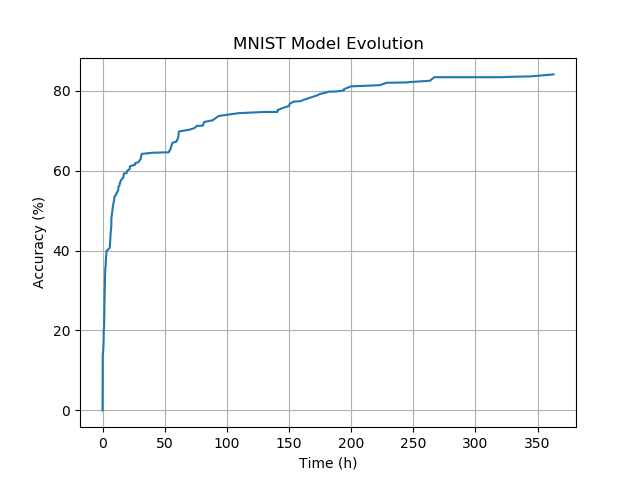

# EAGLE
an Evolutionary, Automatic and Generic Learning Environment.

## About
EAGLE is a NAS implementation that finds Neural Network architectures from scrach, without making any assumptions about their internal structure, only based on data.

## MNIST architecture search
In this experiment EAGLE finds a network model that can classify MNIST handwritten digits. The diagram shows evolution of the model running on a single CPU (not GPU) over a period of a few days.

